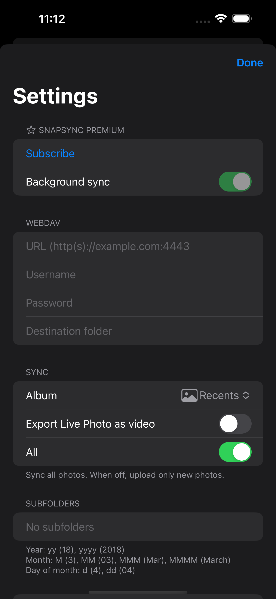
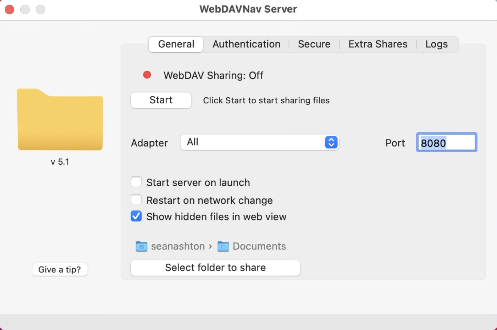

### Setup WebDAV



#### Section `WEBDAV`

1. Enter `URL`: `http(s)://[ip or domain]:[port]`
1. Enter `Username` (leave empty if no authentication)
1. Enter `Password` (leave empty if no authentication)
1. Enter destination folder on the server

#### Section `SYNC`

Choose which Album to Sync (`Recents` for all photos)

#### Section `SUBFOLDERS`

Setup `Subfolders` in the format described on the window

Example: `yyyy/MM-MMMM/` will save photo to subfolder `2023/03-March/[filename]` (based on the photo creation date)

{.main-page-img}

### How to setup WebDAV server on the Mac

Download app on [Mac App Store](https://apps.apple.com/ua/app/webdavnav-server/id747482894?mt=12)

And just launch and you'll find a Start button and url at the bottom

{.main-page-img}

### How to connect to Nextcloud, Owncloud, Synology

Check out how to connect to WebDAV:

- [Synology](https://kb.synology.com/en-in/DSM/tutorial/How_to_access_files_on_Synology_NAS_with_WebDAV)
- [Nextcloud](https://docs.rocket.chat/use-rocket.chat/workspace-administration/integrations/nextcloud-and-webdav)
- [Owncloud](https://doc.owncloud.com/webui/next/classic_ui/files/access_webdav.html)

---

Feedback: [hello.snapsync@gmail.com](mailto:hello.snapsync@gmail.com)
